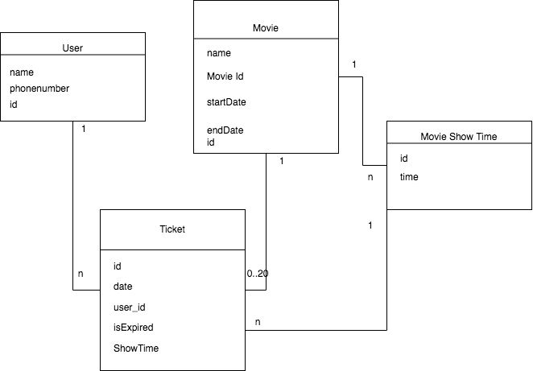

[](https://codeclimate.com/github/rohitjain00/ticket-booking-api/maintainability)
[](https://app.codacy.com/manual/rohitjain00/ticket-booking-api?utm_source=github.com&utm_medium=referral&utm_content=rohitjain00/ticket-booking-api&utm_campaign=Badge_Grade_Dashboard)
[](https://travis-ci.com/rohitjain00/ticket-booking-api)

## PROBLEM STATEMENT:

You have to design a REST interface for a movie theatre ticket booking system. It should
support the following business cases:

* An endpoint to book a ticket using a user’s name, phone number, and timings.
* An endpoint to update a ticket timing.
* An endpoint to view all the tickets for a particular time.
* An endpoint to delete a particular ticket.
* An endpoint to view the user’s details based on the ticket id.
* Mark a ticket as expired if there is a diff of 8 hours between the ticket timing and current
time.
* Note: For a particular timing, a maximum of 20 tickets can be booked.
* You should follow the REST paradigm while building your application.
* You can use any database you like.
* Create a proper readme for your project.
* Plus point if you could delete all the tickets which are expired automatically.
* Plus point if you could write the tests for all the endpoints.
* Please attach a screenshot of your postman while testing your application.
* Please avoid plagiarism.

## About the API

### Endpoints
1. A `post` request to `/ticket/` would result in booking of ticket
2. A `put` request to `/ticket/` would result in updating time of ticket
3. A `get` request to `/ticket/` would result in a list of ticket with same movie, timing, date
4. A `delete` request to `/ticket/` would result in deletion of ticket
5. A `get` request to `/ticket/u/{ticket_id}` would result in user details of the ticket.

### Scheduler
A [BackgroundScheduler](https://apscheduler.readthedocs.io/en/stable/modules/schedulers/background.html) is used to start the jobs of marking the ticket as expired every 1 hour and removing the expired tickets every 24 hours.

File where the jobs are started : [__init__.py](app/main/__init__.py)

Cron Jobs : [cron.py](app/main/util/cron.py)

### Database
SQLite is used as database. Below is the ER diagram.



### Tests
tests are added to each endpoint.

Visit the file [test_ticket.py](app/test/test_ticket.py)

### CI/CD

TravisCI is used for the running the tests after each push

Heroku is used for deploying the application.

## To run the app

1. Install the dependencies from `requirements.txt` file
2. Run the development server by
```bash
python manage.py run
```

This will start a dev server at `http://127.0.0.1:5000/`

## To run the tests

The app is configured to use a seperate database while running the tests. This will be present with the name of `ticket_booking_test.db` in the `app/main` folder. While the `ticket_booking_main.db` is used as the main db.

Run the following command to run the tests.
```bash
python manage.py test
```

## Postman Screen Shots


